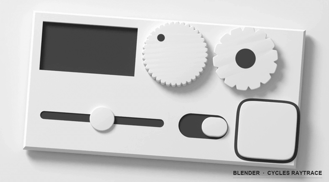

# Ambient CSS

**A physics-based lighting system for CSS.** Define a light source, and every shadow, highlight, and surface gradient follows from it — no more hand-tuned `shadow-sm` / `shadow-md` / `shadow-lg`.

[Live Demo](https://ambientcss.vercel.app/) &nbsp;&bull;&nbsp; [Documentation](https://kikkupico.github.io/ambientcss/) &nbsp;&bull;&nbsp; [npm (@ambientcss/css)](https://www.npmjs.com/package/@ambientcss/css) &nbsp;&bull;&nbsp; [npm (@ambientcss/components)](https://www.npmjs.com/package/@ambientcss/components)



---

## Why?

Traditional CSS shadow scales are decorative — a card with `shadow-lg` next to a button with `shadow-sm` doesn't imply a shared physical scene. They're just two unrelated blur values coexisting on the same page.

Ambient CSS starts from physical lighting principles. You describe a lighting environment — light direction, key/fill intensity, hue, and elevation — and all shadows, edge highlights, and surface gradients follow deterministically. Change the light vector on a container, and *every child element updates consistently*.

## How It Works

The engine models UI surfaces as physical materials under a two-light system (key light + fill light). Every element reads shared CSS custom properties and generates a 5-layer composite `box-shadow`:

1. **Drop shadow** — directional umbra & penumbra scaled by physical elevation
2. **Fillet highlight** — specular inner edge highlight facing the light source
3. **Fillet shadow** — soft inner shadow on the opposite edge
4. **Chamfer highlight** — wide, beveled inner glow along lit facets
5. **Chamfer shadow** — dark bevel shadow on shadowed edges

Each element combines five core material concerns:

```
Structure ─── ambient               (enables lighting calculations)
Surface ───── flat / concave / convex (background lighting gradient)
Edge ──────── chamfer / fillet / groove (beveled & rounded edge cuts)
Material ──── matte / shiny / glass  (specular reflection & translucency)
Depth ──────── elevation 0–3          (drop shadow height)
```

Lighting behavior is physically grounded and calibrated against raytraced 3D reference models built with Blender ([`ambient3d`](./ambient3d)).

---

## Quick Start

### Pure CSS

```bash
npm install @ambientcss/css
```

```html
<link rel="stylesheet" href="node_modules/@ambientcss/css/dist/ambient.css" />

<!-- Set up light environment on any parent -->
<div class="amb-light-tl">
  <button class="ambient amb-surface amb-chamfer amb-elevation-1 amb-rounded">
    Click me
  </button>
</div>
```

### React Components

```bash
npm install @ambientcss/components @ambientcss/css
```

```tsx
import { AmbientProvider, AmbientButton, AmbientKnob, AmbientPanel } from "@ambientcss/components";
import "@ambientcss/components/styles.css";

function App() {
  return (
    <AmbientProvider theme={{ lightX: -1, lightY: -1, keyLight: 0.9, fillLight: 0.7 }}>
      <AmbientPanel>
        <AmbientButton>Press</AmbientButton>
        <AmbientKnob size={80} value={0.5} />
      </AmbientPanel>
    </AmbientProvider>
  );
}
```

---

## Monorepo Packages & Modules

| Package | Path | Description |
|---|---|---|
| [`@ambientcss/css`](./packages/ambient-css) | [`packages/ambient-css`](./packages/ambient-css) | Pure CSS lighting framework — zero dependencies, works with any framework or plain HTML |
| [`@ambientcss/components`](./packages/ambient-components) | [`packages/ambient-components`](./packages/ambient-components) | Tactile React component library (Provider, Panel, Button, Knob, Fader, Slider, Switch) |
| [`ambient3d`](./ambient3d) | [`ambient3d`](./ambient3d) | Parametric Blender 3D component kit & ground-truth raytracing calibration engine |
| `docs` | [`apps/docs`](./apps/docs) | Interactive Docusaurus documentation website & live code playground |
| `demo` | [`apps/demo`](./apps/demo) | Hardware synthesizer & audio gear live demo application |

---

## CSS API Overview

### Light Direction & Environment

Set on any ancestor element, inherited by all descendants:

`.amb-light-tl` `.amb-light-tr` `.amb-light-bl` `.amb-light-br` `.amb-light-top` `.amb-light-bottom` `.amb-light-left` `.amb-light-right`

Custom CSS variables for granular light manipulation:

```css
.my-scene {
  --amb-light-x: -0.7;               /* Horizontal (-1 left, 1 right) */
  --amb-light-y: -0.8;               /* Vertical (-1 top, 1 bottom) */
  --amb-key-light-intensity: 0.9;    /* Primary directional light (0..1) */
  --amb-fill-light-intensity: 0.6;   /* Ambient fill light (0..1) */
  --amb-light-hue: 234;              /* Light hue (0..360) */
  --amb-light-saturation: 15%;       /* Light saturation */
}
```

### Surfaces & Gradients

`.amb-surface` `.amb-surface-darker` `.amb-surface-darkest` `.amb-surface-lighter` `.amb-surface-lightest` `.amb-surface-concave` `.amb-surface-concave-h` `.amb-surface-convex`

### Edge Cuts & Treatments

`.amb-chamfer` `.amb-chamfer-2` `.amb-fillet` `.amb-fillet-2` `.amb-groove`

### Materials & Finishes

`.amb-mat-matte` `.amb-mat-shiny` `.amb-mat-glass`

### Physical Depth & Elevation

- **Elevation (drop shadow scale):** `.amb-elevation-0` `.amb-elevation-1` `.amb-elevation-2` `.amb-elevation-3`
- **Material Thickness:** `.amb-thickness-0` `.amb-thickness-1` `.amb-thickness-2`

### Emissive Lights & Glow

- **Emissive Indicators:** `.amb-emit-red` `.amb-emit-green` `.amb-emit-amber` `.amb-emit-cyan` `.amb-emit-blue` `.amb-emit-white`
- **Bloom / Glow Effect:** `.amb-glow`

### Shape Utilities

`.amb-rounded` `.amb-rounded-md` `.amb-rounded-lg` `.amb-rounded-xl` `.amb-rounded-full`

---

## Starter Examples

Check out the [`examples/`](./examples) directory for ready-to-run starters:

- **CSS & HTML:** [`css-basic`](./examples/css-basic), [`css-purecss`](./examples/css-purecss), [`css-tailwind`](./examples/css-tailwind)
- **React:** [`react-ambientcss`](./examples/react-ambientcss), [`react-basic`](./examples/react-basic), [`react-bootstrap`](./examples/react-bootstrap), [`react-tailwind`](./examples/react-tailwind)

---

## Development & Contributing

```bash
# Clone repository
git clone https://github.com/kikkupico/ambientcss.git
cd ambientcss

# Install workspace dependencies
pnpm install

# Build all packages
pnpm build

# Typecheck workspace
pnpm typecheck

# Start demo app
pnpm --filter demo dev

# Start documentation site
pnpm docs:dev

# Run release checks
pnpm release:check
```

See [RELEASING.md](./RELEASING.md) for publishing workflows and changeset instructions.

---

## License

[MIT](./LICENSE)

